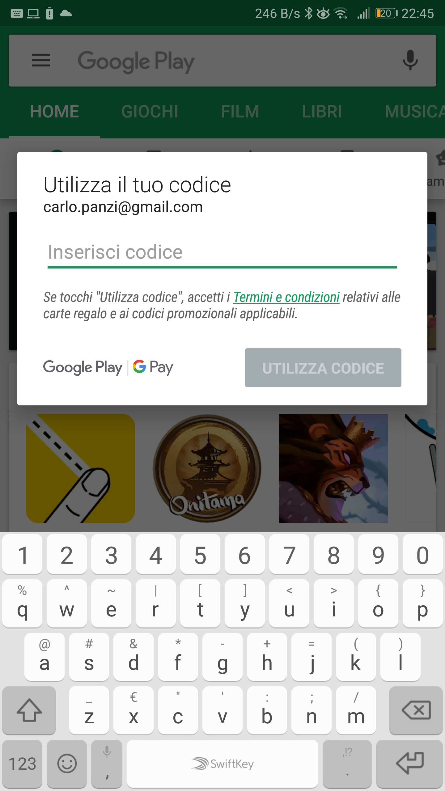

# Usare i codici promo

Per usare un codice promozioniale:

+ Aprire Google Play Store
+ Aprire il menu laterale tramite il tasto in alto a sinistra con le tre linee orizzontali
+ Selezionare `Utilizza Codice`
+ Inserire il codice, e dalla schermata di conferma si potrà installare l'applicazionie

